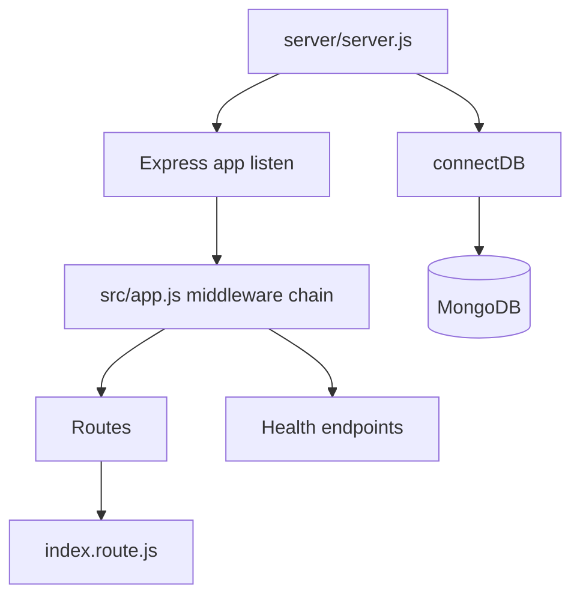
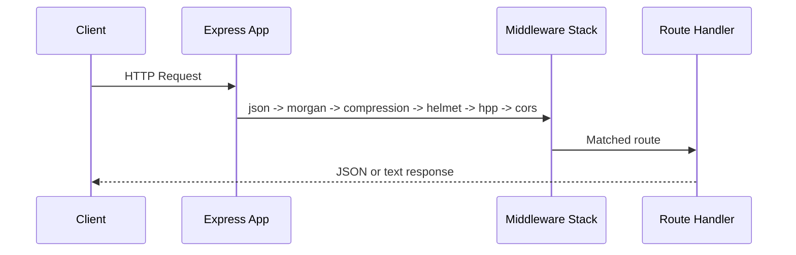

# The FastDrive - Engineering Documentation

The FastDrive repository currently contains a backend service scaffold built with Node.js, Express, and MongoDB. This README documents the **actual implementation state** from the code in `server/`, and links deeper technical docs for architecture, API, security, database planning, and contribution standards.

## 1) Project Overview

### What the platform does (current state)
- Boots an Express HTTP server with production-oriented middleware defaults.
- Connects to MongoDB at startup through Mongoose.
- Exposes operational endpoints for basic service verification:
  - `GET /`
  - `GET /status/healthz`
  - `GET /status/readyz`
- Provides reusable infrastructure utilities for async error wrapping, custom errors, and logging.

### Problem it solves (current scope)
- Establishes a hardened backend foundation so product features can be added on top of a stable runtime.
- Standardizes startup, environment handling, and baseline security middleware before domain modules are introduced.

### Target users (current scope)
- Backend engineers setting up the initial service.
- DevOps/SRE engineers validating service availability and Mongo connectivity.
- Contributors extending the API surface from scaffold to business modules.

### Core features implemented
- Express app bootstrap (`server/src/app.js`)
- MongoDB connection bootstrap (`server/src/configs/database.js`)
- Environment config loader (`server/src/configs/environment.js`)
- CORS policy callback (`server/src/configs/corsOptions.js`)
- Winston logger with console + file transports (`server/src/utils/logger.js`)
- Shared async and error utilities (`server/src/utils/asyncHandler.js`, `server/src/utils/errors.js`)

### Architecture style
- **Modular monolith scaffold (backend-only at present)**:
  - Entry point (`server.js`)
  - App composition layer (`src/app.js`)
  - Config modules (`src/configs/*`)
  - Utility modules (`src/utils/*`)
  - Middleware modules (`src/middlewares/*`)
  - Route registry (`src/routes/index.route.js`)

### Tech stack
- Runtime: Node.js (ES Modules)
- Web: Express 5
- Database: MongoDB + Mongoose
- Security middleware: Helmet, HPP, CORS
- Performance middleware: Compression
- Request logging: Morgan
- Application logging: Winston
- Dev tools: Nodemon, Prettier

### Why this architecture was chosen (as reflected in code)
- `server.js` connects DB before listening, reducing partial-start failures.
- Middleware stack in `app.js` centralizes hardening and parsing early.
- Config and utility separation avoids coupling feature modules to startup code.
- Empty router registry (`index.route.js`) indicates intentional staged rollout of feature APIs.

## 2) Project Architecture

Detailed architecture documentation is in [`docs/architecture.md`](docs/architecture.md).

### High-level runtime diagram



### Request lifecycle (current)



## 3) Folder Structure Documentation

Complete structure guide is in [`docs/project-structure.md`](docs/project-structure.md).

## 4) File-Level Documentation

Primary file-level references:
- `server/server.js`: startup orchestration and failure handling.
- `server/src/app.js`: middleware composition + health endpoints + route mounting.
- `server/src/configs/environment.js`: env loading + required key checks.
- `server/src/configs/database.js`: Mongo connection helper.
- `server/src/configs/corsOptions.js`: dynamic CORS origin validation.
- `server/src/utils/logger.js`: unified logging sinks.
- `server/src/middlewares/errorHandler.middleware.js`: centralized error serializer.
- `server/src/utils/asyncHandler.js`: async route wrapper.
- `server/src/utils/errors.js`: `AppError` custom class.
- `server/src/routes/index.route.js`: feature route aggregation point (currently empty).

## 5) Package Analysis

Detailed package classification and rationale: [`docs/architecture.md`](docs/architecture.md) (Package Analysis section).

## 6) Scripts Documentation

From `server/package.json`:
- `npm run dev` -> `nodemon server.js` (auto restart in development)
- `npm start` -> `node server.js` (production-style start)
- `npm test` -> placeholder failing script (Not currently implemented)
- `npm run format` -> `prettier --write .`
- `npm run format:check` -> `prettier --check .`

## 7) Environment Variables Documentation

Full env reference and `.env.example`: [`docs/architecture.md`](docs/architecture.md) + [`docs/security.md`](docs/security.md).

Current required keys in code:
- `PORT`
- `SERVER_HOST`
- `MONGO_URI`

Additional runtime-sensitive key used:
- `NODE_ENV` (controls stack trace exposure in error responses)

## 8) Database Documentation

Current database implementation and future schema blueprint are documented in [`docs/database.md`](docs/database.md), including:
- Existing implementation status
- Proposed entities (User, UserProfile, Organization, Campaigns, Participants, Likes, Feedbacks, Messages, Notifications, Admin)
- Relationship model, indexing strategy, and scalability notes

## 9) Coding Standards

See [`docs/contributing.md`](docs/contributing.md) for:
- Naming and module conventions
- Controller/service/repository pattern guidance for future modules
- Async/error response standards based on current utilities

## 10) Prettier & Formatting Documentation

Current Prettier config explained line-by-line in [`docs/contributing.md`](docs/contributing.md).

## 11) Error Handling Strategy

Centralized strategy and current gaps are documented in:
- [`docs/architecture.md`](docs/architecture.md)
- [`docs/security.md`](docs/security.md)

## 12) Security Documentation

Current controls and missing safeguards:
- [`docs/security.md`](docs/security.md)

## 13) API Documentation

Current endpoints and conventions:
- [`docs/api.md`](docs/api.md)

## 14) Setup Guide

### Prerequisites
- Node.js (LTS recommended)
- npm
- MongoDB instance (Atlas or self-hosted)

### Install

```bash
cd server
npm install
```

### Configure environment
Create `server/.env`:

```env
SERVER_HOST=http://localhost:9000
PORT=9000
MONGO_URI=<your-mongodb-connection-string>
```

### Start development server

```bash
cd server
npm run dev
```

### Start production-style server

```bash
cd server
npm start
```

### Formatting

```bash
cd server
npm run format
npm run format:check
```

### Linting
- Not currently implemented (no ESLint config/scripts found).

## 15) Future Improvements

- Add domain modules under `src/modules/*` and mount via `index.route.js`.
- Add validation layer (e.g., Zod/Joi/express-validator) per route.
- Wire `errorHandler` into `app.js` and add 404 handler.
- Add auth stack (JWT + refresh strategy + secure cookies where needed).
- Add rate limiting and input sanitization middleware.
- Add test framework and CI validation workflow.
- Add API versioning (`/api/v1`) and OpenAPI/Swagger generation.
- Add structured observability (request IDs, metrics, traces).

---

## Documentation Index
- [Architecture](docs/architecture.md)
- [Database](docs/database.md)
- [API](docs/api.md)
- [Security](docs/security.md)
- [Project Structure](docs/project-structure.md)
- [Contributing](docs/contributing.md)
