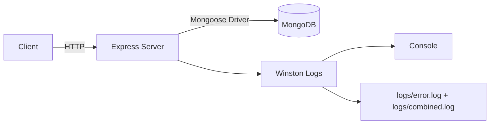
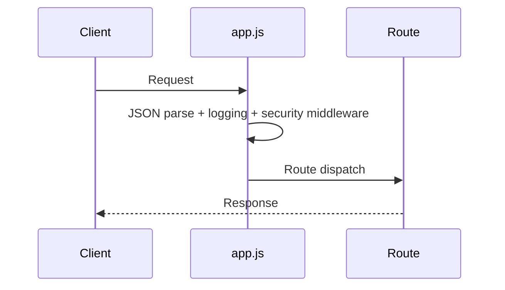

# Architecture Guide

## System Scope

Current repository scope is a **single backend service** in `server/`. No frontend application, SDK package, Kubernetes manifests, or Docker configuration were found in this codebase.

## Runtime Topology

## Backend Architecture

### Entry and boot sequence
1. `server/server.js` imports app, env config, logger, and `connectDB`.
2. `startServer()` calls `connectDB()` before starting HTTP listener.
3. If DB connect fails, process exits with non-zero status.
4. If startup succeeds, server listens on `envConfig.PORT`.

**Why this matters**
- Avoids serving requests while DB is unavailable.
- Produces deterministic startup failure behavior for orchestration systems.

### App composition (`src/app.js`)
Middleware order:
1. `express.json()`
2. `morgan('dev')`
3. `compression()`
4. `helmet()`
5. `hpp()`
6. `cors(corsOptions)`
7. core routes (`/`, `/status/healthz`, `/status/readyz`)
8. `indexRoutes`

**Benefits**
- Security controls are applied before route handling.
- Logging and payload parsing are standardized globally.

**Tradeoffs**
- Global JSON parser means non-JSON APIs still pay parser middleware checks.
- CORS callback currently allows all localhost origins, broad for local dev.

## API Architecture

- Routing entrypoint: `src/routes/index.route.js` (currently no feature routes).
- Health/status endpoints are directly in `app.js` rather than a dedicated status router.
- No API versioning namespace currently implemented.

## Request Lifecycle

## Error Handling Flow

Implemented components:
- `src/utils/asyncHandler.js` for async route wrapper.
- `src/utils/errors.js` exposes `AppError`.
- `src/middlewares/errorHandler.middleware.js` serializes errors and conditionally includes stack traces when `NODE_ENV=development`.

Current gap:
- `errorHandler` is **not currently mounted** in `src/app.js`, so centralized error formatting is present but inactive.

## Validation Flow

- Not currently implemented (no request validation library or validators folder found).

## State Management

- Frontend state management: Not currently implemented (frontend code not present).
- Backend state strategy: stateless HTTP handlers with DB persistence planned.

## Authentication Flow

- Not currently implemented (no auth routes, JWT utilities, or session middleware found).

## SDK Architecture

- Not currently implemented (no SDK package/folder found).

## Package Analysis (actual `server/package.json`)

### Core Backend
- `express`: HTTP server framework.
- `morgan`: request logging middleware.
- `compression`: gzip/deflate response compression.

### Security
- `helmet`: secure HTTP headers.
- `hpp`: blocks HTTP Parameter Pollution patterns.
- `cors`: origin control and cross-origin policy.

### Database
- `mongoose`: MongoDB ODM and connection manager.

### Configuration
- `dotenv`: `.env` loading into `process.env`.

### Logging
- `winston`: application logger with multiple transports.

### Dev Tooling
- `nodemon` (devDependency): hot-reload server on file changes.
- `prettier` (devDependency): code formatting and style consistency.

## Script Analysis

From `server/package.json`:
- `dev`: `nodemon server.js`
- `start`: `node server.js`
- `test`: placeholder fails intentionally (`Error: no test specified`)
- `format`: `prettier --write .`
- `format:check`: `prettier --check .`

## Environment Variables

Detected usage:
- `SERVER_HOST`: logged at startup, informational host value.
- `PORT`: listen port.
- `MONGO_URI`: required for DB connection.
- `NODE_ENV`: controls stack trace emission in error responses.

Required key warning behavior:
- `environment.js` logs missing keys but does not throw; service may still proceed until runtime failure point.

## Missing but Recommended Platform Layers

- API versioning (`/api/v1`)
- Domain modules (`controllers/services/repositories/validators`)
- Centralized response envelope conventions
- Request correlation IDs for tracing
- Automated tests + CI checks
- Deployment descriptors (Docker/K8s) if infra targets containers
