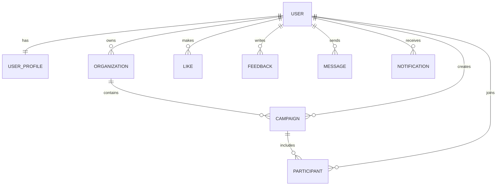

# Database Documentation

## Current Implementation Status

### What exists in code now
- Mongoose connection bootstrap only (`server/src/configs/database.js`).
- No defined schemas/models in repository.
- No migrations, seeders, or repository layer currently implemented.

### Operational behavior
- Service startup waits for successful MongoDB connection.
- On connection error, process exits (`process.exit(1)`), preventing half-ready runtime.

## Existing Database Config Contract

Required env variable:
- `MONGO_URI`: passed to `mongoose.connect()`.

If missing or invalid:
- Startup fails and server does not begin listening.

## Planned Entity Architecture (Professional Blueprint)

The following design reflects your requested entities and is provided as an implementation-ready MongoDB architecture proposal, since these schemas are not yet present in code.

## Entity Catalog

### 1) User
- Identity root for authentication and account lifecycle.
- Suggested fields: `email`, `phone`, `passwordHash`, `status`, `roles`, `lastLoginAt`, timestamps.
- Indexes: unique on `email`, sparse unique on `phone`, index on `status`.

### 2) UserProfile
- Profile/PII separation from auth-critical `User` record.
- Suggested fields: `userId`, `name`, `avatar`, `bio`, locale/timezone, preferences.
- Relationship: one-to-one (`UserProfile.userId -> User._id`, unique index).

### 3) Organization
- Multi-tenant boundary for teams/brands.
- Suggested fields: `name`, `slug`, `ownerUserId`, `settings`, `plan`, `status`.
- Indexes: unique on `slug`, index on `ownerUserId`.

### 4) Campaign
- Core business unit for initiatives/drive workflows.
- Suggested fields: `organizationId`, `createdBy`, `title`, `description`, `status`, `visibility`, `startAt`, `endAt`, `metadata`.
- Indexes: compound `(organizationId, status, startAt)`.

### 5) Participant
- Joins users to campaigns with role/progress states.
- Suggested fields: `campaignId`, `userId`, `role`, `joinedAt`, `state`, `score`.
- Indexes: unique compound `(campaignId, userId)`; secondary on `(userId, joinedAt)`.

### 6) Like
- Lightweight reaction edge.
- Suggested fields: `entityType`, `entityId`, `userId`, timestamps.
- Indexes: unique compound `(entityType, entityId, userId)`.

### 7) Feedback
- Rich content reactions/reviews.
- Suggested fields: `entityType`, `entityId`, `authorUserId`, `rating`, `text`, `attachments`, `status`.
- Indexes: `(entityType, entityId, createdAt)`, `(authorUserId, createdAt)`.

### 8) Message
- In-app communication unit.
- Suggested fields: `threadId`, `senderUserId`, `recipientUserIds`, `body`, `type`, `readBy[]`, timestamps.
- Indexes: `(threadId, createdAt)`, `(recipientUserIds, createdAt)`.

### 9) Notification
- Delivery record for user-alert events.
- Suggested fields: `userId`, `kind`, `payload`, `channel`, `readAt`, `sentAt`, `status`.
- Indexes: `(userId, readAt, createdAt)`, TTL optional for expired ephemeral notifications.

### 10) Admin
- Elevated operational control principal.
- Prefer modeling as `User` role unless policy isolation requires separate collection.
- If separate: `userId`, `permissions`, `scopes`, `grantedBy`, `grantedAt`.

## Relationship Diagram

## Validation Strategy (recommended)

- Use schema-level enums for status fields (`active|inactive|archived`, etc.).
- Use Mongoose custom validators for cross-field constraints (`startAt < endAt`).
- Enforce reference existence for critical foreign keys at service layer.
- Normalize input in validators before persistence (trim, lowercase emails, bounded strings).

## Indexing Strategy (recommended)

- Identity & uniqueness:
  - `User.email` unique
  - `Organization.slug` unique
  - `Participant(campaignId,userId)` unique
- Query acceleration:
  - Time-ordered feeds (`createdAt` descending indexes)
  - Tenant-scoped retrieval (`organizationId` leading in compounds)
- Lifecycle & retention:
  - Optional TTL indexes for transient notification/event records.

## Scalability Considerations

- Prefer reference links over deep embedding for high-churn relations (messages, participants).
- Keep write-heavy activity in append-only collections where possible.
- Introduce read models / materialized counters for hot endpoints (e.g., like counts).
- Plan archival policies for old campaigns/messages to keep active indexes small.

## Security Considerations

- Store only password hashes (never raw password).
- Avoid placing sensitive PII inside broad-access collections.
- Add `createdBy/updatedBy` fields for auditability in privileged collections.
- Restrict admin operations through role + permission checks and audited actions.

## Missing Schemas to Add

- `Session` or `RefreshToken` (token revocation and device/session tracking)
- `AuditLog` (admin and security-sensitive actions)
- `ActivityEvent` (product analytics/event stream)
- `MediaAsset` (file metadata, storage references, ACLs)
- `WebhookDelivery` (if external integrations are planned)
